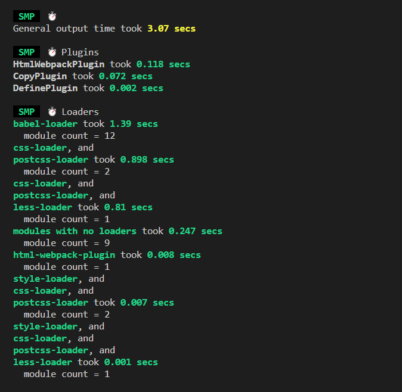
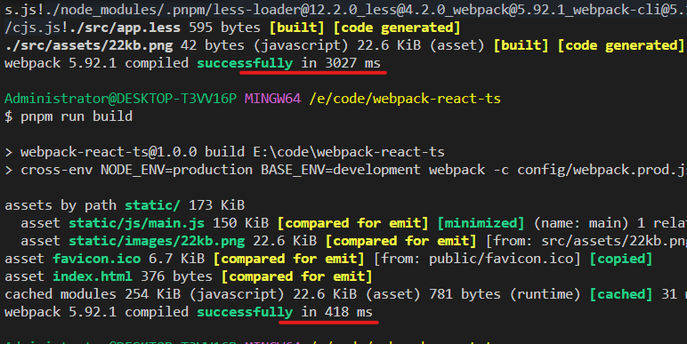

## 一. 前言

本文将使用最新的**webpack5**一步一步从零搭建一个完整的**react18+ts**开发和打包环境，配置完善的模块热替换以及**构建速度**和**构建结果**的优化

## 二. 初始化项目

在开始**webpack**配置之前，先手动初始化一个基本的**react**+**ts**项目，新建项目文件夹**webpack-react-ts**, 在项目下执行

```bash
pnpm init  // npm yarn 都可以
```

初始化好**package.json**后,在项目下新增以下所示目录结构和文件

```yaml
├── config
|   ├── webpack.base.js # 公共配置
|   ├── webpack.dev.js  # 开发环境配置
|   └── webpack.prod.js # 打包环境配置
├── public
│   └── index.html # html模板
├── src
|   ├── App.tsx
│   └── index.tsx # react应用入口页面
├── tsconfig.json  # ts配置
└── package.json
```

安装**webpack**依赖

```sh
pnpm i webpack webpack-cli -D
```

安装**react**依赖

```sh
pnpm i react react-dom -S
```

安装**react**类型依赖

```sh
pnpm i @types/react @types/react-dom @types/node -D
```

添加**public/index.html**内容

```html
<!DOCTYPE html>
<html lang="en">
  <head>
    <meta charset="UTF-8" />
    <meta http-equiv="X-UA-Compatible" content="IE=edge" />
    <meta name="viewport" content="width=device-width, initial-scale=1.0" />
    <title>webpack5-react-ts</title>
  </head>
  <body>
    <!-- 容器节点 -->
    <div id="root"></div>
  </body>
</html>
```

添加**tsconfig.json**内容

```json
{
  "compilerOptions": {
    "target": "ESNext",
    "lib": ["DOM", "DOM.Iterable", "ESNext"],
    "allowJs": false,
    "skipLibCheck": false,
    "esModuleInterop": false,
    "allowSyntheticDefaultImports": true,
    "strict": true,
    "forceConsistentCasingInFileNames": true,
    "module": "ESNext",
    "moduleResolution": "Node",
    "resolveJsonModule": true,
    "isolatedModules": true,
    "noEmit": true,
    "jsx": "react-jsx"
  },
  "include": ["./src"]
}
```

添加**src/App.tsx**内容

```tsx
import React from 'react';

function App() {
  return <h2>webpack5-react-ts</h2>;
}
export default App;
```

添加**src/index.tsx**内容

```tsx
import React from 'react';
import { createRoot } from 'react-dom/client';
import App from './App';

const root = createRoot(document.getElementById('root')!);

root.render(<App />);
```

ok，现在基本的业务代码已经添加好了，开始**webpack**配置部分

## 三. 配置基础版 React+ts 环境

### 1 webpack 公共配置

修改**webpack.base.js**

**1-1. 配置入口文件**

```js
// webpack.base.js
const path = require('path');

module.exports = {
  entry: path.join(__dirname, '../src/index.tsx'), // 入口文件
};
```

**1-2. 配置出口文件**

```js
// webpack.base.js
const path = require('path');

module.exports = {
  // ...
  // 打包文件出口
  output: {
    filename: 'static/js/[name].js', // 每个输出js的名称
    path: path.join(__dirname, '../dist'), // 打包结果输出路径
    clean: true, // webpack4需要配置clean-webpack-plugin来删除dist文件,webpack5内置了
    publicPath: '/', // 打包后文件的公共前缀路径
  },
};
```

**1-3. 配置 loader 解析 ts 和 jsx**

由于**webpack**默认只能识别**js**文件,不能识别**jsx**语法,需要配置**loader**的预设预设 [**@babel/preset-typescript**](https://www.babeljs.cn/docs/babel-preset-typescript) 来先**ts**语法转换为 **js** 语法,再借助预设 [**@babel/preset-react**](https://www.babeljs.cn/docs/babel-preset-react) 来识别**jsx**语法。

**安装 babel 核心模块和 babel 预设**

```sh
pnpm i babel-loader @babel/core @babel/preset-env @babel/preset-react @babel/preset-typescript -D
```

在**webpack.base.js**添加**module.rules**配置

```js
// webpack.base.js
module.exports = {
  // ...
  module: {
    rules: [
      {
        test: /.(js|jsx|ts|tsx)$/, // 匹配.js, jsx, ts, tsx文件
        use: {
          loader: 'babel-loader',
          options: {
            // 预设执行顺序由右往左,所以先处理ts,再处理jsx
            presets: [
              '@babel/preset-env',
              '@babel/preset-react',
              '@babel/preset-typescript',
            ],
          },
        },
      },
    ],
  },
};
```

**1-4. 配置 extensions**

**extensions**是**webpack**的**resolve**解析配置下的选项，在引入模块时不带文件后缀时，会来该配置数组里面依次添加后缀查找文件，因为**ts**不支持引入以 **.ts**, **tsx**为后缀的文件，所以要在**extensions**中配置，而第三方库里面很多引入**js**文件没有带后缀，所以也要配置下**js**

修改**webpack.base.js**，注意把高频出现的文件后缀放在前面

```js
// webpack.base.js
module.exports = {
  // ...
  resolve: {
    extensions: ['.js', '.tsx', '.ts'],
  },
};
```

这里只配置**js**, **tsx**和**ts**，其他文件引入都要求带后缀，可以提升构建速度。

**添加 html-webpack-plugin 插件**

**webpack**需要把最终构建好的静态资源都引入到一个**html**文件中,这样才能在浏览器中运行,[html-webpack-plugin](https://www.npmjs.com/package/html-webpack-plugin)就是来做这件事情的,安装依赖：

```sh
pnpm i html-webpack-plugin -D
```

因为该插件在开发和构建打包模式都会用到,所以还是放在公共配置**webpack.base.js**里面

```js
// webpack.base.js
const path = require('path');
const HtmlWebpackPlugin = require('html-webpack-plugin');

module.exports = {
  // ...
  plugins: [
    new HtmlWebpackPlugin({
      template: path.resolve(__dirname, '../public/index.html'), // 模板取定义root节点的模板
      inject: true, // 自动注入静态资源
    }),
  ],
};
```

到这里一个最基础的**react**基本公共配置就已经配置好了,需要在此基础上分别配置开发环境和打包环境了。

### 2 webpack 开发环境配置

**2-1. 安装 webpack-dev-server**
开发环境配置代码在**webpack.dev.js**中,需要借助 [webpack-dev-server](https://www.npmjs.com/package/webpack-dev-server)在开发环境启动服务器来辅助开发,还需要依赖[webpack-merge](https://www.npmjs.com/package/webpack-merge)来合并基本配置,安装依赖:

```sh
pnpm i webpack-dev-server webpack-merge -D
```

修改**webpack.dev.js**代码, 合并公共配置，并添加开发模式配置

```js
// webpack.dev.js
const path = require('path');
const { merge } = require('webpack-merge');
const baseConfig = require('./webpack.base.js');

// 合并公共配置,并添加开发环境配置
module.exports = merge(baseConfig, {
  mode: 'development', // 开发模式,打包更加快速,省了代码优化步骤
  devtool: 'eval-cheap-module-source-map', // 源码调试模式,后面会讲
  devServer: {
    port: 8080, // 服务端口号
    compress: false, // gzip压缩,开发环境不开启,提升热更新速度
    hot: true, // 开启热更新，后面会讲react模块热替换具体配置
    historyApiFallback: true, // 解决history路由404问题
    static: {
      directory: path.join(__dirname, '../public'), //托管静态资源public文件夹
    },
  },
});
```

**2-2. package.json 添加 dev 脚本**

在**package.json**的**scripts**中添加

```js
// package.json
"scripts": {
  "start": "pnpm run dev",
  "dev": "webpack-dev-server -c config/webpack.dev.js"
},
```

执行**pnpm run start**,就能看到项目已经启动起来了,访问<http://localhost:8080/>,就可以看到项目界面,具体完善的**react**模块热替换在下面会讲到。

### 3 webpack 打包环境配置

**3-1. 修改 webpack.prod.js 代码**

```js
// webpack.prod.js

const { merge } = require('webpack-merge');
const baseConfig = require('./webpack.base.js');
module.exports = merge(baseConfig, {
  mode: 'production', // 生产模式,会开启tree-shaking和压缩代码,以及其他优化
});
```

**3-2. package.json 添加 build 打包命令脚本**

在**package.json**的**scripts**中添加**build**打包命令

```js
"scripts": {
    "start": "pnpm run dev",
    "dev": "webpack-dev-server -c config/webpack.dev.js",
    "build": "webpack -c config/webpack.prod.js"
},
```

执行**npm run build**,最终打包在**dist**文件中, 打包结果:

```sh
dist
├── static
|   ├── js
|     ├── main.js
├── index.html
```

**3-3. 浏览器查看打包结果**

打包后的**dist**文件可以在本地借助**node**服务器**serve**打开,全局安装**serve**

```sh
pnpm i serve -g
```

然后在项目根目录命令行执行**serve -s dist**,就可以启动打包后的项目了。

到现在一个基础的支持**react**和**ts**的**webpack5**就配置好了,但只有这些功能是远远不够的,还需要继续添加其他配置。

## 四. 基础功能配置

### 1. 配置环境变量

环境变量按作用来分分两种

1. 区分是开发模式还是打包构建模式
2. 区分项目业务环境,开发/测试/预测/正式环境

区分开发模式还是打包构建模式可以用**process.env.NODE_ENV**,因为很多第三方包里面判断都是采用的这个环境变量。

区分项目接口环境可以自定义一个环境变量**process.env.BASE_ENV**,设置环境变量可以借助[cross-env](https://www.npmjs.com/package/cross-env)和[webpack.DefinePlugin](https://www.webpackjs.com/plugins/define-plugin/)来设置。

- **cross-env**：兼容各系统的设置环境变量的包
- **webpack.DefinePlugin**：**webpack**内置的插件,可以为业务代码注入环境变量

这里我们使用 **cross-env** 安装**cross-env**

```sh
pnpm i cross-env -D
```

修改**package.json**的**scripts**脚本字段,删除原先的**dev**和**build**,改为

```js
 "scripts": {
    "start": "pnpm run dev",
    "dev": "cross-env NODE_ENV=development BASE_ENV=development webpack-dev-server -c config/webpack.dev.js",
    "dev:test": "cross-env NODE_ENV=development BASE_ENV=test webpack-dev-server -c config/webpack.dev.js",
    "dev:prod": "cross-env NODE_ENV=development BASE_ENV=production webpack-dev-server -c config/webpack.dev.js",
    "build": "cross-env NODE_ENV=production BASE_ENV=development webpack -c config/webpack.prod.js",
    "build:test": "cross-env NODE_ENV=production BASE_ENV=test webpack -c config/webpack.prod.js",
    "build:prod": "cross-env NODE_ENV=production BASE_ENV=production webpack -c config/webpack.prod.js"
  },
```

**dev**开头是开发模式,**build**开头是打包模式,冒号后面对应的**dev**/**test**/**prod**是对应的业务环境的**开发**/**测试**/**正式**环境。这里将开发的简化了

**process.env.NODE_ENV**环境变量**webpack**会自动根据设置的**mode**字段来给业务代码注入对应的**development**和**prodction**,这里在命令中再次设置环境变量**NODE_ENV**是为了在**webpack**和**babel**的配置文件中访问到。

在**webpack.base.js**中打印一下设置的环境变量

```js
// webpack.base.js
// ...
console.log('NODE_ENV', process.env.NODE_ENV);
console.log('BASE_ENV', process.env.BASE_ENV);
```

执行**npm run build**,可以看到打印的信息

```js
// NODE_ENV production
// BASE_ENV development
```

当前是打包模式,业务环境是开发环境,这里需要把**process.env.BASE_ENV**注入到业务代码里面,就可以通过该环境变量设置对应环境的接口地址和其他数据,要借助**webpack.DefinePlugin**插件。

修改**webpack.base.js**

```js
// webpack.base.js
// ...
const webpack = require('webpack');
module.export = {
  // ...
  plugins: [
    // ...
    new webpack.DefinePlugin({
      'process.env.BASE_ENV': JSON.stringify(process.env.BASE_ENV),
    }),
  ],
};
```

配置后会把值注入到业务代码里面去,**webpack**解析代码匹配到**process.env.BASE_ENV**,就会设置到对应的值。测试一下，在**src/index.tsx**打印一下两个环境变量

```tsx
// src/index.tsx
// ...
console.log('NODE_ENV', process.env.NODE_ENV);
console.log('BASE_ENV', process.env.BASE_ENV);
```

执行**npm run dev:test**,可以在浏览器控制台看到打印的信息

```js
// NODE_ENV development
// BASE_ENV test
```

当前是开发模式,业务环境是测试环境。

### 2. 处理 css 和 less 文件

在**src**下新增**app.css**

```css
h2 {
  color: red;
  transform: translateY(100px);
}
```

在**src/App.tsx**中引入**app.css**

```tsx
import React from 'react';
import './app.css';

function App() {
  return <h2>webpack-react-ts</h2>;
}

export default App;
```

这个时候看我们起的开发服务会报错，因为**webpack**默认只认识**js**,是不识别**css**文件的,需要使用**loader**来解析**css**, 安装依赖

```sh
pnpm i style-loader css-loader -D
```

- **style-loader**: 把解析后的**css**代码从**js**中抽离,放到头部的**style**标签中(在运行时做的)
- **css-loader:** 解析**css**文件代码

因为解析**css**的配置开发和打包环境都会用到,所以加在公共配置**webpack.base.js**中

上面提到过,**loader**执行顺序是从右往左,从下往上的,匹配到**css**文件后先用**css-loader**解析**css**, 最后借助**style-loader**把**css**插入到头部**style**标签中。

配置完成后再**npm run start**打包,借助**serve -s dist**启动后在浏览器查看,可以看到样式生效了。


### 3. 支持 less 或 scss

项目开发中,为了更好的提升开发体验,一般会使用**css**超集**less**或者**scss**,对于这些超集也需要对应的**loader**来识别解析。以**less**为例,需要安装依赖:

```sh
pnpm i less-loader less -D
```

- **less-loader**: 解析**less**文件代码,把**less**编译为**css**
- **less**: **less**核心

实现支持**less**也很简单,只需要在**rules**中添加**less**文件解析,遇到**less**文件,使用**less-loader**解析为**css**,再进行**css**解析流程,修改**webpack.base.js**：

```js
// webpack.base.js
module.exports = {
  // ...
  module: {
    // ...
    rules: [
      // ...
      {
        test: /.less$/, //匹配 css和less 文件
        use: ['style-loader', 'css-loader', 'less-loader'],
      },
    ],
  },
  // ...
};
```

测试一下,新增**src/app.less**，改动了配置文件重启服务生效

```less
h2 {
  font-size: 20px;
}
```

### 4. 处理 css3 前缀兼容

虽然**css3**现在浏览器支持率已经很高了, 但有时候需要兼容一些低版本浏览器,需要给**css3**加前缀,可以借助插件来自动加前缀, [postcss-loader](https://link.juejin.cn/?target=https%3A%2F%2Fwebpack.docschina.org%2Floaders%2Fpostcss-loader%2F)就是来给**css3**加浏览器前缀的,安装依赖：

```sh
pnpm i postcss-loader autoprefixer -D
```

- **postcss-loader**：处理**css**时自动加前缀
- **autoprefixer**：决定添加哪些浏览器前缀到**css**中

修改**webpack.base.js**, 在解析**css**和**less**的规则中添加配置

```js
module.exports = {
  // ...
  module: {
    rules: [
      // ...
      {
        test: /.(css|less)$/, //匹配 css和less 文件
        use: [
          'style-loader',
          'css-loader',
          // 新增
          {
            loader: 'postcss-loader',
            options: {
              postcssOptions: {
                plugins: ['autoprefixer'],
              },
            },
          },
          'less-loader',
        ],
      },
    ],
  },
  // ...
};
```

配置完成后,需要有一份要兼容浏览器的清单,让**postcss-loader**知道要加哪些浏览器的前缀,在根目录创建 **.browserslistrc**文件

```sh
IE 9 # 兼容IE 9
chrome 35 # 兼容chrome 35
```

以兼容到**ie9**和**chrome35**版本为例,配置好后,执行**npm run build:dev**打包,可以看到打包后的**css**文件已经加上了**ie**和谷歌内核的前缀


上面可以看到解析**css**和**less**有很多重复配置,可以进行提取**postcss-loader**配置优化一下

**postcss.config.js**是**postcss-loader**的配置文件,会自动读取配置,根目录新建**postcss.config.js**：

```js
module.exports = {
  plugins: ['autoprefixer'],
};
```

修改**webpack.base.js**, 取消**postcss-loader**的**options**配置

```js
// webpack.base.js
// ...
module.exports = {
  // ...
  module: {
    rules: [
      // ...
      {
        test: /.(css|less)$/, //匹配 css和less 文件
        use: ['style-loader', 'css-loader', 'postcss-loader', 'less-loader'],
      },
    ],
  },
  // ...
};
```

提取**postcss-loader**配置后,再次打包,可以看到依然可以解析**css**, **less**文件, **css3**对应前缀依然存在。

### 5. css 以及 css module 兼容

直接引入 css 文件会有样式污染等问题，这里兼容一下 css module 模式可以有效避免样式污染问题，less 同理

```js
// webpack.base.js
// ...
{
  test: /\.css$/,
  exclude: /\.module\.css$/,
  use: ['style-loader', 'css-loader'],
},
{
  test: /\.module\.css$/,
  use: [
    'style-loader',
    {
      loader: 'css-loader',
      options: {
        modules: true,
      },
    },
  ],
},
```

```js
// app.module.css
.app {
    color: orange;
    transform: translateY(100px);
}

// App.tsx
import * as css from './app.module.css';

<h2 className={css.app}>webpack-react-ts</h2>
```

> 这个时候在引入 '.module.css' 的地方会报：**找不到模块“找不到模块“./app.module.css”或其相应的类型声明**，需要添加一个 css module 的声明文件

新增**typings.d.ts**文件，添加内容

```js
declare module '*.svg'
declare module '*.png'
declare module '*.jpg'
declare module '*.jpeg'
declare module '*.gif'
declare module '*.bmp'
declare module '*.tiff'
declare module '*.less'
declare module '*.css'
```

添加完模块声明后，即可解决报红

### 6. babel 预设处理 js 兼容

现在**js**不断新增很多方便好用的标准语法来方便开发,甚至还有非标准语法比如装饰器,都极大的提升了代码可读性和开发效率。但前者标准语法很多低版本浏览器不支持,后者非标准语法所有的浏览器都不支持。需要把最新的标准语法转换为低版本语法,把非标准语法转换为标准语法才能让浏览器识别解析,而**babel**就是来做这件事的,这里只讲配置,更详细的可以看[Babel 那些事儿](https://juejin.cn/post/6992371845349507108)。

安装依赖

```sh
pnpm i babel-loader @babel/core @babel/preset-env core-js -D
```

- babel-loader: 使用 **babel** 加载最新 js 代码并将其转换为 **ES5**（上面已经安装过）
- @babel/core: **babel** 编译的核心包（上面已经安装过）
- @babel/preset-env: **babel** 编译的预设,可以转换目前最新的**js**标准语法（上面已经安装过）
- core-js: 使用低版本**js**语法模拟高版本的库,也就是垫片

修改**webpack.base.js**

```js
// webpack.base.js
module.exports = {
  // ...
  module: {
    rules: [
      {
        test: /.(ts|tsx)$/,
        use: {
          loader: 'babel-loader',
          options: {
            // 执行顺序由右往左,所以先处理ts,再处理jsx,最后再试一下babel转换为低版本语法
            presets: [
              [
                '@babel/preset-env',
                {
                  // 设置兼容目标浏览器版本,这里可以不写,babel-loader会自动寻找上面配置好的文件.browserslistrc
                  // "targets": {
                  //  "chrome": 35,
                  //  "ie": 9
                  // },
                  useBuiltIns: 'entry', // 根据配置的浏览器兼容,以及代码中使用到的api进行引入polyfill按需添加
                  corejs: { version: 3, proposals: true }, // 配置使用core-js低版本
                },
              ],
              '@babel/preset-react',
              '@babel/preset-typescript',
            ],
          },
        },
      },
    ],
  },
};
```

此时再打包就会把语法转换为对应浏览器兼容的语法了。

为了避免**webpack**配置文件过于庞大,可以把**babel-loader**的配置抽离出来, 新建**babel.config.js**文件,使用**js**作为配置文件,是因为可以访问到**process.env.NODE_ENV**环境变量来区分是开发还是打包模式。

```js
// babel.config.js
module.exports = {
  // 执行顺序由右往左,所以先处理ts,再处理jsx,最后再试一下babel转换为低版本语法
  presets: [
    [
      '@babel/preset-env',
      {
        // 设置兼容目标浏览器版本,这里可以不写,babel-loader会自动寻找上面配置好的文件.browserslistrc
        targets: {
          chrome: 35,
        },
        useBuiltIns: 'entry', // 根据配置的浏览器兼容,以及代码中使用到的api进行引入polyfill按需添加
        corejs: { version: 3, proposals: true }, // 配置使用core-js使用的版本
      },
    ],
    '@babel/preset-react',
    '@babel/preset-typescript',
  ],
};
```

现在可以移除**webpack.base.js**中**babel-loader**的**options**配置

```js
// webpack.base.js
module.exports = {
  // ...
  module: {
    rules: [
      {
        test: /.(ts|tsx)$/,
        use: 'babel-loader',
      },
      // 如果node_moduels中也有要处理的语法，可以把js|jsx文件配置加上
      // {
      //  test: /.(js|jsx)$/,
      //  use: 'babel-loader'
      // }
      // ...
    ],
  },
};
```

### 7. babel 处理 js 非标准语法

现在**react**主流开发都是函数组件和**react-hooks**,但有时也会用类组件,可以用装饰器简化代码。

新增**src/components/Class.tsx**组件, 在**App.tsx**中引入该组件使用

```tsx
import React, { PureComponent } from 'react';

// 装饰器为,组件添加age属性
function addAge(Target: Function) {
  Target.prototype.age = 111;
}
// 使用装饰圈
@addAge
class Class extends PureComponent {
  age?: number;

  render() {
    return <h2>我是类组件---{this.age}</h2>;
  }
}

export default Class;
```

需要开启一下**ts**装饰器支持,修改**tsconfig.json**文件

```js
// tsconfig.json
{
  "compilerOptions": {
    // ...
    // 开启装饰器使用
    "experimentalDecorators": true
  }
}
```

上面 Class 组件代码中使用了装饰器,目前**js**标准语法是不支持的,现在运行或者打包会报错,不识别装饰器语法,需要借助**babel-loader**插件,安装依赖

```sh
pnpm i @babel/plugin-proposal-decorators -D
```

在**babel.config.js**中添加插件

```js
module.exports = {
  // ...
  plugins: [['@babel/plugin-proposal-decorators', { legacy: true }]],
};
```

现在项目就支持装饰器了。

### 8. 复制 public 文件夹

一般**public**文件夹都会放一些静态资源,可以直接根据绝对路径引入,比如**图片**,**css**,**js**文件等,不需要**webpack**进行解析,只需要打包的时候把**public**下内容复制到构建出口文件夹中,可以借助[copy-webpack-plugin](https://www.npmjs.com/package/copy-webpack-plugin)插件,安装依赖

```sh
pnpm i copy-webpack-plugin -D
```

开发环境已经在**devServer**中配置了**static**托管了**public**文件夹,在开发环境使用绝对路径可以访问到**public**下的文件,但打包构建时不做处理会访问不到,所以现在需要在打包配置文件**webpack.prod.js**中新增**copy**插件配置。

```js
// webpack.prod.js
// ..
const path = require('path');
const CopyPlugin = require('copy-webpack-plugin');
module.exports = merge(baseConfig, {
  mode: 'production',
  plugins: [
    // 复制文件插件
    new CopyPlugin({
      patterns: [
        {
          from: path.resolve(__dirname, '../public'), // 复制public下文件
          to: path.resolve(__dirname, '../dist'), // 复制到dist目录中
          filter: (source) => {
            return !source.includes('index.html'); // 忽略index.html
          },
        },
      ],
    }),
  ],
});
```

在上面的配置中,忽略了**index.html**,因为**html-webpack-plugin**会以**public**下的**index.html**为模板生成一个**index.html**到**dist**文件下,所以不需要再复制该文件了。

测试一下,在**public**中新增一个[**favicon.ico**]图标文件,在**index.html**中引入

```html
<!DOCTYPE html>
<html lang="en">
  <head>
    <meta charset="UTF-8" />
    <!-- 绝对路径引入图标文件 -->
    <link
      data-n-head="ssr"
      rel="icon"
      type="image/x-icon"
      href="/favicon.ico"
    />
    <meta http-equiv="X-UA-Compatible" content="IE=edge" />
    <meta name="viewport" content="width=device-width, initial-scale=1.0" />
    <title>webpack5-react-ts</title>
  </head>
  <body>
    <!-- 容器节点 -->
    <div id="root"></div>
  </body>
</html>
```

再执行**pnpm run build**打包,就可以看到**public**下的**favicon.ico**图标文件被复制到**dist**文件中了。

### 9. 处理图片文件

对于图片文件,**webpack4**使用**file-loader**和**url-loader**来处理的,但**webpack5**不使用这两个**loader**了,而是采用自带的[**asset-module**](https://webpack.js.org/guides/asset-modules/#root)来处理

修改**webpack.base.js**,添加图片解析配置

```js
module.exports = {
  module: {
    rules: [
      // ...
      {
        test: /.(png|jpg|jpeg|gif|svg)$/, // 匹配图片文件
        type: 'asset', // type选择asset
        parser: {
          dataUrlCondition: {
            maxSize: 10 * 1024, // 小于10kb转base64位
          },
        },
        generator: {
          filename: 'static/images/[name][ext]', // 文件输出目录和命名
        },
      },
    ],
  },
};
```

测试一下,准备一张小于[10kb]()的图片和大于[10kb]()的图片,放在**src/assets/imgs**目录下, 修改**App.tsx**:

```js
import React from 'react';
import smallImg from './assets/imgs/5kb.png';
import bigImg from './assets/imgs/22kb.png';
import './app.css';
import './app.less';

function App() {
  return (
    <>
      
      
    </>
  );
}
export default App;
```

因为在上面已经添加图片声明文件，所以可以正常引入图片

**css**中的背景图片一样也可以解析,修改**app.tsx**。

### 10. 处理字体和媒体文件

字体文件和媒体文件这两种资源处理方式和处理图片是一样的,只需要把匹配的路径和打包后放置的路径修改一下就可以了。修改**webpack.base.js**文件：

```js
// webpack.base.js
module.exports = {
  module: {
    rules: [
      // ...
      {
        test: /.(woff2?|eot|ttf|otf)$/, // 匹配字体图标文件
        type: 'asset', // type选择asset
        parser: {
          dataUrlCondition: {
            maxSize: 10 * 1024, // 小于10kb转base64位
          },
        },
        generator: {
          filename: 'static/fonts/[name][ext]', // 文件输出目录和命名
        },
      },
      {
        test: /.(mp4|webm|ogg|mp3|wav|flac|aac)$/, // 匹配媒体文件
        type: 'asset', // type选择asset
        parser: {
          dataUrlCondition: {
            maxSize: 10 * 1024, // 小于10kb转base64位
          },
        },
        generator: {
          filename: 'static/media/[name][ext]', // 文件输出目录和命名
        },
      },
    ],
  },
};
```

## 五. 配置 react 模块热更新

热更新上面已经在**devServer**中配置**hot**为**true**, 在**webpack4**中,还需要在插件中添加了**HotModuleReplacementPlugin**,在**webpack5**中,只要**devServer.hot**为**true**了,该插件就已经内置了。

现在开发模式下修改**css**和**less**文件，页面样式可以在不刷新浏览器的情况实时生效，因为此时样式都在**style**标签里面，**style-loader**做了替换样式的热替换功能。但是修改**App.tsx**,浏览器会自动刷新后再显示修改后的内容,但我们想要的不是刷新浏览器,而是在不需要刷新浏览器的前提下模块热更新,并且能够保留**react**组件的状态。

可以借助[@pmmmwh/react-refresh-webpack-plugin](https://www.npmjs.com/package/@pmmmwh/react-refresh-webpack-plugin)插件来实现,该插件又依赖于[react-refresh](https://www.npmjs.com/package/react-refresh), 安装依赖：

```sh
pnpm i @pmmmwh/react-refresh-webpack-plugin react-refresh -D
```

配置**react**热更新插件,修改**webpack.dev.js**

```js
// webpack.dev.js
const ReactRefreshWebpackPlugin = require('@pmmmwh/react-refresh-webpack-plugin');

module.exports = merge(baseConfig, {
  // ...
  plugins: [
    new ReactRefreshWebpackPlugin(), // 添加热更新插件
  ],
});
```

为**babel-loader**配置**react-refesh**刷新插件,修改**babel.config.js**文件

```js
const isDEV = process.env.NODE_ENV === 'development'; // 是否是开发模式
module.exports = {
  // ...
  plugins: [
    isDEV && require.resolve('react-refresh/babel'), // 如果是开发模式,就启动react热更新插件
    // ...
  ].filter(Boolean), // 过滤空值
};
```

测试一下,修改**App.tsx**代码

```tsx
import React, { useState } from 'react';

function App() {
  const [count, setCounts] = useState('');
  const onChange = (e: any) => {
    setCounts(e.target.value);
  };
  return (
    <>
      <h2>webpack5+react+ts</h2>
      <p>受控组件</p>
      <input type='text' value={count} onChange={onChange} />
      <br />
      <p>非受控组件</p>
      <input type='text' />
    </>
  );
}
export default App;
```

在两个输入框分别输入内容后,修改**App.tsx**中**h2**标签的文本,会发现在不刷新浏览器的情况下,页面内容进行了热更新,并且**react**组件状态也会保留。

> 新增或者删除页面**hooks**时,热更新时组件状态不会保留。

## 六. 优化构建速度

### 1. 构建耗时分析

当进行优化的时候,肯定要先知道时间都花费在哪些步骤上了,而[speed-measure-webpack-plugin](https://www.npmjs.com/package/speed-measure-webpack-plugin)插件可以帮我们做到,安装依赖：

```sh
pnpm i speed-measure-webpack-plugin -D
```

使用的时候为了不影响到正常的开发/打包模式,我们选择新建一个配置文件,新增**webpack**构建分析配置文件**build/webpack.analy.js**

```js
const prodConfig = require('./webpack.prod.js'); // 引入打包配置
const SpeedMeasurePlugin = require('speed-measure-webpack-plugin'); // 引入webpack打包速度分析插件
const smp = new SpeedMeasurePlugin(); // 实例化分析插件
const { merge } = require('webpack-merge'); // 引入合并webpack配置方法

// 使用smp.wrap方法,把生产环境配置传进去,由于后面可能会加分析配置,所以先留出合并空位
module.exports = smp.wrap(merge(prodConfig, {}));
```

修改**package.json**添加启动**webpack**打包分析脚本命令,在**scripts**新增：

```js
{
  // ...
  "scripts": {
    // ...
    "build:analy": "cross-env NODE_ENV=production BASE_ENV=production webpack -c build/webpack.analy.js"
  }
  // ...
}
```

执行**npm run build:analy**命令



可以在图中看到各**plugin**和**loader**的耗时时间,现在因为项目内容比较少,所以耗时都比较少,在真正的项目中可以通过这个来分析打包时间花费在什么地方,然后来针对性的优化。

### 2. 开启持久化存储缓存

在**webpack5**之前做缓存是使用**babel-loader**缓存解决**js**的解析结果,**cache-loader**缓存**css**等资源的解析结果,还有模块缓存插件**hard-source-webpack-plugin**,配置好缓存后第二次打包,通过对文件做哈希对比来验证文件前后是否一致,如果一致则采用上一次的缓存,可以极大地节省时间。

**webpack5** 较于 **webpack4**,新增了持久化缓存、改进缓存算法等优化,通过配置 [webpack 持久化缓存](https%3A%2F%2Fwebpack.docschina.org%2Fconfiguration%2Fcache%2F%23root),来缓存生成的 **webpack** 模块和 **chunk**,改善下一次打包的构建速度,可提速 **90%** 左右,配置也简单，修改**webpack.base.js**

```js
// webpack.base.js
// ...
module.exports = {
  // ...
  cache: {
    type: 'filesystem', // 使用文件缓存
  },
};
```

| 模式         | 第一次耗时 | 第二次耗时 |
| ------------ | ---------- | ---------- |
| 启动开发模式 | 4206 毫秒  | 420 毫秒   |
| 启动打包模式 | 3027 毫秒  | 418 毫秒   |

通过开启**webpack5**持久化存储缓存,再次打包的时间提升了**90%**。


缓存的存储位置在**node_modules/.cache/webpack**,里面又区分了**development**和**production**缓存

### 3. 开启多线程 loader

**webpack**的**loader**默认在单线程执行,现代电脑一般都有多核**cpu**,可以借助多核**cpu**开启多线程**loader**解析,可以极大地提升**loader**解析的速度,[thread-loader](https://link.juejin.cn/?target=https%3A%2F%2Fwebpack.docschina.org%2Floaders%2Fthread-loader%2F%23root)就是用来开启多进程解析**loader**的,安装依赖

```sh
pnpm i thread-loader -D
```

使用时,需将此 **loader** 放置在其他 **loader** 之前。放置在此 **loader** 之后的 **loader** 会在一个独立的 **worker** 池中运行。

修改**webpack.base.js**

```js
// webpack.base.js
module.exports = {
  // ...
  module: {
    rules: [
      {
        test: /.(ts|tsx)$/,
        use: ['thread-loader', 'babel-loader'],
      },
    ],
  },
};
```

由于**thread-loader**不支持抽离 css 插件**MiniCssExtractPlugin.loader**(下面会讲),所以这里只配置了多进程解析**js**,开启多线程也是需要启动时间,大约**600ms**左右,所以适合规模比较大的项目。

### 4. 配置 alias 别名

**webpack**支持设置别名**alias**,设置别名可以让后续引用的地方减少路径的复杂度。

修改**webpack.base.js**

```js
module.export = {
  // ...
  resolve: {
    // ...
    alias: {
      '@': path.join(__dirname, '../src'),
    },
  },
};
```

修改**tsconfig.json**,添加**baseUrl**和**paths**

```js
{
  "compilerOptions": {
    // ...
    "baseUrl": ".",
    "paths": {
      "@/*": [
        "src/*"
      ]
    }
  }
}
```

配置修改完成后,在项目中使用 **@/xxx.xx**,就会指向项目中**src/xxx.xx,**在**js/ts**文件和**css**文件中都可以用。

**src/App.tsx**可以修改为

```tsx
import React from 'react';
import smallImg from '@/assets/imgs/5kb.png';
import bigImg from '@/assets/imgs/22kb.png';
import '@/app.css';
import '@/app.less';

function App() {
  return (
    <>
      
      
      <div className='smallImg'></div> {/* 小图片背景容器 */}
      <div className='bigImg'></div> {/* 大图片背景容器 */}
    </>
  );
}
export default App;
```

**src/app.less**可以修改为

```less
// app.less
#root {
  .smallImg {
    width: 69px;
    height: 75px;
    background: url('@/assets/imgs/5kb.png') no-repeat;
  }
  .bigImg {
    width: 232px;
    height: 154px;
    background: url('@/assets/imgs/22kb.png') no-repeat;
  }
}
```

### 5. 缩小 loader 作用范围

一般第三库都是已经处理好的,不需要再次使用**loader**去解析,可以按照实际情况合理配置**loader**的作用范围,来减少不必要的**loader**解析,节省时间,通过使用 **include**和**exclude** 两个配置项,可以实现这个功能,常见的例如：

- **include**：只解析该选项配置的模块
- **exclude**：不解该选项配置的模块,优先级更高

修改**webpack.base.js**

```js
// webpack.base.js
const path = require('path')
module.exports = {
  // ...
  module: {
    rules: [
      {
        include: [path.resolve(__dirname, '../src')], 只对项目src文件的ts,tsx进行loader解析
        test: /.(ts|tsx)$/,
        use: ['thread-loader', 'babel-loader']
      }
    ]
  }
}
```

其他**loader**也是相同的配置方式,如果除**src**文件外也还有需要解析的,就把对应的目录地址加上就可以了,比如需要引入**antd**的**css**,可以把**antd**的文件目录路径添加解析**css**规则到**include**里面。

### 6. 缩小模块搜索范围

**node**里面模块有三种

- **node**核心模块
- **node_modules**模块
- 自定义文件模块

使用**require**和**import**引入模块时如果有准确的相对或者绝对路径,就会去按路径查询,如果引入的模块没有路径,会优先查询**node**核心模块,如果没有找到会去当前目录下**node_modules**中寻找,如果没有找到会查从父级文件夹查找**node_modules**,一直查到系统**node**全局模块。

这样会有两个问题,一个是当前项目没有安装某个依赖,但是上一级目录下**node_modules**或者全局模块有安装,就也会引入成功,但是部署到服务器时可能就会找不到造成报错,另一个问题就是一级一级查询比较消耗时间。可以告诉**webpack**搜索目录范围,来规避这两个问题。

修改**webpack.base.js**

```js
// webpack.base.js
const path = require('path');
module.exports = {
  // ...
  resolve: {
    // ...
    modules: [path.resolve(__dirname, '../node_modules')], // 查找第三方模块只在本项目的node_modules中查找
  },
};
```

### 7. devtool 配置

开发过程中或者打包后的代码都是**webpack**处理后的代码,如果进行调试肯定希望看到源代码,而不是编译后的代码, [source map](http://blog.teamtreehouse.com/introduction-source-maps)就是用来做源码映射的,不同的映射模式会明显影响到构建和重新构建的速度, [**devtool**](https://webpack.js.org/configuration/devtool/)选项就是**webpack**提供的选择源码映射方式的配置。

**devtool**的命名规则为 **^(inline-|hidden-|eval-)?(nosources-)?(cheap-(module-)?)?source-map$**

| 关键字    | 描述                                                     |
| --------- | -------------------------------------------------------- |
| inline    | 代码内通过 dataUrl 形式引入 SourceMap                    |
| hidden    | 生成 SourceMap 文件,但不使用                             |
| eval      | `eval(...)` 形式执行代码,通过 dataUrl 形式引入 SourceMap |
| nosources | 不生成 SourceMap                                         |
| cheap     | 只需要定位到行信息,不需要列信息                          |
| module    | 展示源代码中的错误位置                                   |

开发环境推荐：**eval-cheap-module-source-map**

- 本地开发首次打包慢点没关系,因为 **eval** 缓存的原因, 热更新会很快
- 开发中,我们每行代码不会写的太长,只需要定位到行就行,所以加上 **cheap**
- 我们希望能够找到源代码的错误,而不是打包后的,所以需要加上 **module**

修改**webpack.dev.js**

```js
// webpack.dev.js
module.exports = {
  // ...
  devtool: 'eval-cheap-module-source-map',
};
```

打包环境推荐：**none**(就是不配置**devtool**选项了，不是配置**devtool**: '**none**')

```js
// webpack.prod.js
module.exports = {
  // ...
  // devtool: '', // 不用配置devtool此项
};
```

- **none**话调试只能看到编译后的代码,也不会泄露源代码,打包速度也会比较快。
- 只是不方便线上排查问题, 但一般都可以根据报错信息在本地环境很快找出问题所在。

### 8. 其他优化配置

除了上面的配置外，**webpack**还提供了其他的一些优化方式,本次搭建没有使用到，所以只简单罗列下

- [**externals**](https://www.webpackjs.com/configuration/externals/): 外包拓展，打包时会忽略配置的依赖，会从上下文中寻找对应变量
- [**module.noParse**](https://www.webpackjs.com/configuration/module/#module-noparse): 匹配到设置的模块,将不进行依赖解析，适合**jquery**,**boostrap**这类不依赖外部模块的包
- [**ignorePlugin**](https://webpack.js.org/plugins/ignore-plugin/#root): 可以使用正则忽略一部分文件，常在使用多语言的包时可以把非中文语言包过滤掉

## 七. 优化构建结果文件

### 1. webpack 包分析工具

[webpack-bundle-analyzer](https://www.npmjs.com/package/webpack-bundle-analyzer)是分析**webpack**打包后文件的插件,使用交互式可缩放树形图可视化 **webpack** 输出文件的大小。通过该插件可以对打包后的文件进行观察和分析,可以方便我们对不完美的地方针对性的优化,安装依赖：

```sh
pnpm install webpack-bundle-analyzer -D
```

修改**webpack.analy.js**

```js
// webpack.analy.js
const prodConfig = require('./webpack.prod.js');
const SpeedMeasurePlugin = require('speed-measure-webpack-plugin');
const smp = new SpeedMeasurePlugin();
const { merge } = require('webpack-merge');
const { BundleAnalyzerPlugin } = require('webpack-bundle-analyzer'); // 引入分析打包结果插件
module.exports = smp.wrap(
  merge(prodConfig, {
    plugins: [
      new BundleAnalyzerPlugin(), // 配置分析打包结果插件
    ],
  })
);
```

配置好后,执行**npm run build:analy**命令,打包完成后浏览器会自动打开窗口,可以看到打包文件的分析结果页面,可以看到各个文件所占的资源大小。


### 2. 抽取 css 样式文件

在开发环境我们希望**css**嵌入在**style**标签里面,方便样式热替换,但打包时我们希望把**css**单独抽离出来,方便配置缓存策略。而插件[mini-css-extract-plugin](https://github.com/webpack-contrib/mini-css-extract-plugin)就是来帮我们做这件事的,安装依赖：

```sh
pnpm i mini-css-extract-plugin -D
```

修改**webpack.base.js**, 根据环境变量设置开发环境使用**style-looader**,打包模式抽离**css**

```js
// webpack.base.js
// ...
const MiniCssExtractPlugin = require('mini-css-extract-plugin');
const isDev = process.env.NODE_ENV === 'development'; // 是否是开发模式
module.exports = {
  // ...
  module: {
    rules: [
      // ...
      {
        test: /.css$/, //匹配所有的 css 文件
        include: [path.resolve(__dirname, '../src')],
        use: [
          isDev ? 'style-loader' : MiniCssExtractPlugin.loader, // 开发环境使用style-looader,打包模式抽离css
          'css-loader',
          'postcss-loader',
        ],
      },
      {
        test: /.less$/, //匹配所有的 less 文件
        include: [path.resolve(__dirname, '../src')],
        use: [
          isDev ? 'style-loader' : MiniCssExtractPlugin.loader, // 开发环境使用style-looader,打包模式抽离css
          'css-loader',
          'postcss-loader',
          'less-loader',
        ],
      },
    ],
  },
  // ...
};
```

再修改**webpack.prod.js**, 打包时添加抽离 css 插件

```js
// webpack.prod.js
// ...
const MiniCssExtractPlugin = require('mini-css-extract-plugin');
module.exports = merge(baseConfig, {
  mode: 'production',
  plugins: [
    // ...
    // 抽离css插件
    new MiniCssExtractPlugin({
      filename: 'static/css/[name].css', // 抽离css的输出目录和名称
    }),
  ],
});
```

配置完成后,在开发模式**css**会嵌入到**style**标签里面,方便样式热替换,打包时会把**css**抽离成单独的**css**文件。

### 3. 压缩 css 文件

上面配置了打包时把**css**抽离为单独**css**文件的配置,打开打包后的文件查看,可以看到默认**css**是没有压缩的,需要手动配置一下压缩**css**的插件。


可以借助[css-minimizer-webpack-plugin](https://www.npmjs.com/package/css-minimizer-webpack-plugin)来压缩 css,安装依赖

```sh
pnpm i css-minimizer-webpack-plugin -D
```

修改**webpack.prod.js**文件， 需要在优化项[optimization](https://webpack.js.org/configuration/optimization/)下的[minimizer](https://webpack.js.org/configuration/optimization/#optimizationminimizer)属性中配置

```js
// webpack.prod.js
// ...
const CssMinimizerPlugin = require('css-minimizer-webpack-plugin');
module.exports = {
  // ...
  optimization: {
    minimizer: [
      new CssMinimizerPlugin(), // 压缩css
    ],
  },
};
```

再次执行打包就可以看到**css**已经被压缩了。

### 4. 压缩 js 文件

设置**mode**为**production**时,**webpack**会使用内置插件[terser-webpack-plugin](https://www.npmjs.com/package/terser-webpack-plugin)压缩**js**文件,该插件默认支持多线程压缩,但是上面配置**optimization.minimizer**压缩**css**后,**js**压缩就失效了,需要手动再添加一下,**webpack**内部安装了该插件,由于**pnpm**解决了幽灵依赖问题,如果用的**pnpm**的话,需要手动再安装一下依赖。

```sh
pnpm i terser-webpack-plugin -D
```

修改**webpack.prod.js**文件

```js
// ...
const TerserPlugin = require('terser-webpack-plugin');
module.exports = {
  // ...
  optimization: {
    minimizer: [
      // ...
      new TerserPlugin({
        // 压缩js
        parallel: true, // 开启多线程压缩
        terserOptions: {
          compress: {
            pure_funcs: ['console.log'], // 删除console.log
          },
        },
      }),
    ],
  },
};
```

配置完成后再打包,**css**和**js**就都可以被压缩了。

### 5. 合理配置打包文件 hash

项目维护的时候,一般只会修改一部分代码,可以合理配置文件缓存,来提升前端加载页面速度和减少服务器压力,而**hash**就是浏览器缓存策略很重要的一部分。**webpack**打包的**hash**分三种：

- **hash**：跟整个项目的构建相关,只要项目里有文件更改,整个项目构建的**hash**值都会更改,并且全部文件都共用相同的**hash**值
- **chunkhash**：不同的入口文件进行依赖文件解析、构建对应的**chunk**,生成对应的哈希值,文件本身修改或者依赖文件修改,**chunkhash**值会变化
- **contenthash**：每个文件自己单独的 **hash** 值,文件的改动只会影响自身的 **hash** 值

**hash**是在输出文件时配置的,格式是**filename: "[name].\[chunkhash:8][ext]"**,**[xx]** 格式是**webpack**提供的占位符, **:8**是生成**hash**的长度。

| 占位符      | 解释                       |
| ----------- | -------------------------- |
| ext         | 文件后缀名                 |
| name        | 文件名                     |
| path        | 文件相对路径               |
| folder      | 文件所在文件夹             |
| hash        | 每次构建生成的唯一 hash 值 |
| chunkhash   | 根据 chunk 生成 hash 值    |
| contenthash | 根据文件内容生成 hash 值   |

因为**js**我们在生产环境里会把一些公共库和程序入口文件区分开,单独打包构建,采用**chunkhash**的方式生成哈希值,那么只要我们不改动公共库的代码,就可以保证其哈希值不会受影响,可以继续使用浏览器缓存,所以**js**适合使用**chunkhash**。

**css**和图片资源媒体资源一般都是单独存在的,可以采用**contenthash**,只有文件本身变化后会生成新**hash**值。

修改**webpack.base.js**,把**js**输出的文件名称格式加上**chunkhash**,把**css**和图片媒体资源输出格式加上**contenthash**

```js
// webpack.base.js
// ...
module.exports = {
  // 打包文件出口
  output: {
    filename: 'static/js/[name].[chunkhash:8].js', // // 加上[chunkhash:8]
    // ...
  },
  module: {
    rules: [
      {
        test: /.(png|jpg|jpeg|gif|svg)$/, // 匹配图片文件
        // ...
        generator: {
          filename: 'static/images/[name].[contenthash:8][ext]', // 加上[contenthash:8]
        },
      },
      {
        test: /.(woff2?|eot|ttf|otf)$/, // 匹配字体文件
        // ...
        generator: {
          filename: 'static/fonts/[name].[contenthash:8][ext]', // 加上[contenthash:8]
        },
      },
      {
        test: /.(mp4|webm|ogg|mp3|wav|flac|aac)$/, // 匹配媒体文件
        // ...
        generator: {
          filename: 'static/media/[name].[contenthash:8][ext]', // 加上[contenthash:8]
        },
      },
    ],
  },
  // ...
};
```

再修改**webpack.prod.js**,修改抽离**css**文件名称格式

```js
// webpack.prod.js
// ...
const MiniCssExtractPlugin = require('mini-css-extract-plugin');
module.exports = merge(baseConfig, {
  mode: 'production',
  plugins: [
    // 抽离css插件
    new MiniCssExtractPlugin({
      filename: 'static/css/[name].[contenthash:8].css', // 加上[contenthash:8]
    }),
    // ...
  ],
  // ...
});
```

再次打包就可以看到文件后面的**hash**了

### 6. 代码分割第三方包和公共模块

一般第三方包的代码变化频率比较小,可以单独把**node_modules**中的代码单独打包, 当第三包代码没变化时,对应**chunkhash**值也不会变化,可以有效利用浏览器缓存，还有公共的模块也可以提取出来,避免重复打包加大代码整体体积, **webpack**提供了代码分隔功能, 需要我们手动在优化项[optimization](https://webpack.js.org/configuration/optimization/)中手动配置下代码分隔[splitChunks](https://webpack.js.org/configuration/optimization/#optimizationsplitchunks)规则。

修改**webpack.prod.js**

```js
module.exports = {
  // ...
  optimization: {
    // ...
    splitChunks: {
      // 分隔代码
      cacheGroups: {
        vendors: {
          // 提取node_modules代码
          test: /node_modules/, // 只匹配node_modules里面的模块
          name: 'vendors', // 提取文件命名为vendors,js后缀和chunkhash会自动加
          minChunks: 1, // 只要使用一次就提取出来
          chunks: 'initial', // 只提取初始化就能获取到的模块,不管异步的
          minSize: 0, // 提取代码体积大于0就提取出来
          priority: 1, // 提取优先级为1
        },
        commons: {
          // 提取页面公共代码
          name: 'commons', // 提取文件命名为commons
          minChunks: 2, // 只要使用两次就提取出来
          chunks: 'initial', // 只提取初始化就能获取到的模块,不管异步的
          minSize: 0, // 提取代码体积大于0就提取出来
        },
      },
    },
  },
};
```

配置完成后执行打包,可以看到**node_modules**里面的模块被抽离到**vendors.c4a57b8f**中,业务代码在**main.85e68d9e**中。


测试一下,此时**verdors.js**的**chunkhash**是**ec725ef1**,**main.js**文件的**chunkhash**是**85e68d9e**,改动一下**App.tsx**,再次打包,可以看到**main.js**的**chunkhash**值变化了,但是**vendors.js**的**chunkhash**还是原先的,这样发版后,浏览器就可以继续使用缓存中的**verdors.c4a57b8f.js**,只需要重新请求**main.js**就可以了。

### 7. tree-shaking 清理未引用 js

[Tree Shaking](https://webpack.docschina.org/guides/tree-shaking/)的意思就是摇树,伴随着摇树这个动作,树上的枯叶都会被摇晃下来,这里的**tree-shaking**在代码中摇掉的是未使用到的代码,也就是未引用的代码,最早是在**rollup**库中出现的,**webpack**在**2**版本之后也开始支持。模式**mode**为**production**时就会默认开启**tree-shaking**功能以此来标记未引入代码然后移除掉,测试一下。

在**src/components**目录下新增**Demo1**,**Demo2**两个组件

```tsx
// src/components/Demo1.tsx
import React from 'react';

function Demo1() {
  return <h3>我是Demo1组件</h3>;
}
export default Demo1;

// src/components/Demo2.tsx
import React from 'react';

function Demo2() {
  return <h3>我是Demo2组件</h3>;
}
export default Demo2;
```

再在**src/components**目录下新增**index.ts**, 把**Demo1**和**Demo2**组件引入进来再暴露出去

```ts
// src/components/index.ts
export { default as Demo1 } from './Demo1';
export { default as Demo2 } from './Demo2';
```

在**App.tsx**中引入两个组件,但只使用**Demo1**组件

```tsx
// ...
import { Demo1, Demo2 } from '@/components';

function App() {
  return <Demo1 />;
}
export default App;
```

执行打包,可以看到在**main.js**中搜索**Demo**,只搜索到了**Demo1**, 代表**Demo2**组件被**tree-shaking**移除掉了。

### 8. 资源懒加载

像**react**,**vue**等单页应用打包默认会打包到一个**js**文件中,虽然使用代码分割可以把**node_modules**模块和**公共模块**分离,但页面初始加载还是会把整个项目的代码下载下来,其实只需要公共资源和当前页面的资源就可以了,其他页面资源可以等使用到的时候再加载,可以有效提升首屏加载速度。

**webpack**默认支持资源懒加载,只需要引入资源使用**import**语法来引入资源,**webpack**打包的时候就会自动打包为单独的资源文件,等使用到的时候动态加载。

以懒加载组件和**css**为例,新建懒加载组件**src/components/LazyDemo.tsx**

```tsx
import React from 'react';

function LazyDemo() {
  return <h3>我是懒加载组件组件</h3>;
}

export default LazyDemo;
```

修改**App.tsx**

```tsx
import React, { lazy, Suspense, useState } from 'react';
const LazyDemo = lazy(() => import('@/components/LazyDemo')); // 使用import语法配合react的Lazy动态引入资源

function App() {
  const [show, setShow] = useState(false);

  // 点击事件中动态引入css, 设置show为true
  const onClick = () => {
    import('./app.css');
    setShow(true);
  };
  return (
    <>
      <h2 onClick={onClick}>展示</h2>
      {/* show为true时加载LazyDemo组件 */}
      {show && (
        <Suspense fallback={null}>
          <LazyDemo />
        </Suspense>
      )}
    </>
  );
}
export default App;
```

点击展示文字时,才会动态加载**app.css**和**LazyDemo**组件的资源。

### 9. 打包时生成 gzip 文件

前端代码在浏览器运行,需要从服务器把**html**,**css**,**js**资源下载执行,下载的资源体积越小,页面加载速度就会越快。一般会采用**gzip**压缩,现在大部分浏览器和服务器都支持**gzip**,可以有效减少静态资源文件大小,压缩率在 **70%** 左右。

**nginx**可以配置**gzip: on**来开启压缩,但是只在**nginx**层面开启,会在每次请求资源时都对资源进行压缩,压缩文件会需要时间和占用服务器**cpu**资源，更好的方式是前端在打包的时候直接生成**gzip**资源,服务器接收到请求,可以直接把对应压缩好的**gzip**文件返回给浏览器,节省时间和**cpu**。

**webpack**可以借助[compression-webpack-plugin](https://www.npmjs.com/package/compression-webpack-plugin) 插件在打包时生成 **gzip** 文章,安装依赖

```sh
npm i compression-webpack-plugin -D
```

添加配置,修改**webpack.prod.js**

```js
const glob = require('glob');
const CompressionPlugin = require('compression-webpack-plugin');
module.exports = {
  // ...
  plugins: [
    // ...
    new CompressionPlugin({
      test: /.(js|css)$/, // 只生成css,js压缩文件
      filename: '[path][base].gz', // 文件命名
      algorithm: 'gzip', // 压缩格式,默认是gzip
      test: /.(js|css)$/, // 只生成css,js压缩文件
      threshold: 10240, // 只有大小大于该值的资源会被处理。默认值是 10k
      minRatio: 0.8, // 压缩率,默认值是 0.8
    }),
  ],
};
```

配置完成后再打包,可以看到打包后 js 的目录下多了一个 **.gz** 结尾的文件


因为只有**verdors.js**的大小超过了**10k**, 所以只有它生成了**gzip**压缩文件,借助**serve -s dist**启动**dist**,查看**verdors.js**加载情况


可以看到**verdors.js**的原始大小是**182kb**, 使用**gzip**压缩后的文件只剩下了**60.4kb**,减少了**70%** 的大小,可以极大提升页面加载速度。

## 八. 总结

到目前为止已经使用**webpack5**把**react18+ts**的开发环境配置完成，并且配置比较完善的保留组件状态的**热更新**，以及常见的**优化构建速度**和**构建结果**的配置，完整代码已上传到[webpack5-react-ts](https://github.com/guojiongwei/webpack5-react-ts.git)
。还有细节需要优化，比如把容易改变的配置单独写个**config.js**来配置，输出文件路径封装。这篇文章只是配置，如果想学好**webpack**，还需要学习**webpack**的构建原理以及**loader**和**plugin**的实现机制。

本文是总结自己在工作中使用**webpack5**搭建**react+ts**构建环境中使用到的配置, 肯定也很多没有做好的地方，后续有好的使用技巧和配置也会继续更新记录。
